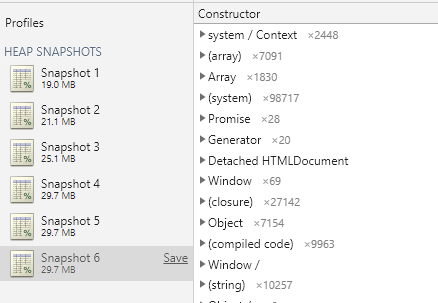
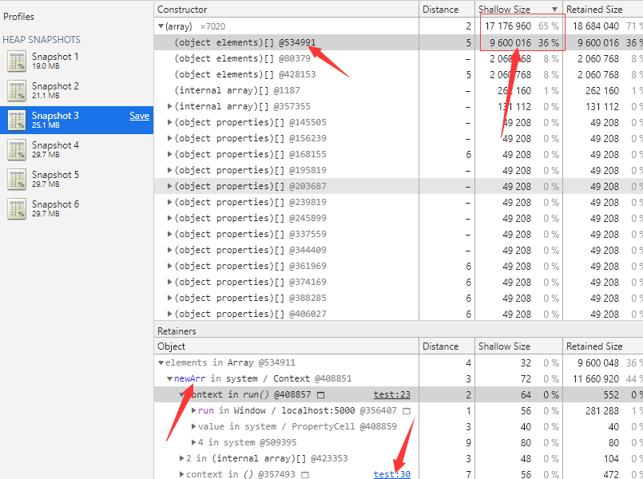

# 深入了解 JavaScript 内存泄露

用户一般不会在一个 Web 页面停留比较久，即使有一点内存泄漏，重载页面内存也会跟着释放。而且浏览器也有自动回收内存的机制，所以我们前端其实并没有像 C、C++ 这类语言一样，特别关注内存泄漏的问题。

但是如果我们对内存泄漏没有什么概念，有时候还是有可能因为内存泄漏，导致页面卡顿。了解内存泄漏，如何避免内存泄漏，也是我们提升前端技能的必经之路。

俗话说好记忆不如烂笔头，所以本人就总结了一些内存泄漏相关的知识，避免一些低级的内存泄漏问题。

## 什么是内存？

> 在硬件级别上，计算机内存由大量触发器组成。每个触发器包含几个晶体管，能够存储一个位。单个触发器可以通过唯一标识符寻址，因此我们可以读取和覆盖它们。因此，从概念上讲，我们可以把我们的整个计算机内存看作是一个巨大的位数组，我们可以读和写。

这么底层的概念，了解下就好，绝大多数数情况下，JavaScript 语言作为你们高级语言，无需我们使用二进制进直接进行读和写。

## 内存生命周期

内存也是有**生命周期**的，不管什么程序语言，一般可以按顺序分为三个周期：

- 分配期

  分配所需要的内存

- 使用期

  使用分配到的内存（读、写）

- 释放期

  不需要时将其释放和归还

内存分配 -> 内存使用 -> 内存释放。

## 什么是内存泄漏？

> 在[计算机科学](https://zh.wikipedia.org/wiki/计算机科学)中，**内存泄漏**指由于疏忽或错误造成程序未能释放已经不再使用的[内存](https://zh.wikipedia.org/wiki/内存)。内存泄漏并非指内存在物理上的消失，而是应用程序分配某段内存后，由于设计错误，导致在释放该段内存之前就失去了对该段内存的控制，从而造成了内存的浪费。

如果内存不需要时，没有经过生命周期的**释放期**，那么就存在**内存泄漏**。

内存泄漏简单理解：无用的内存还在占用，得不到释放和归还。比较严重时，无用的内存会持续递增，从而导致整个系统卡顿，甚至崩溃。

## JavaScript 内存管理机制

> 像 C 语言这样的底层语言一般都有底层的内存管理接口，比如 `malloc()`和`free()`。相反，JavaScript是在创建变量（对象，字符串等）时自动进行了分配内存，并且在不使用它们时“自动”释放。 释放的过程称为垃圾回收。这个“自动”是混乱的根源，并让JavaScript（和其他高级语言）开发者错误的感觉他们可以不关心内存管理。

JavaScript 内存管理机制和内存的**生命周期**是一一对应的。首先需要**分配内存**，然后**使用内存**，最后**释放内存**。

其中 JavaScript 语言**不需要程序员手动**分配内存，绝大部分情况下也不需要手动释放内存，对 JavaScript 程序员来说通常就是使用内存（即使用变量、函数、对象等）。

### 内存分配

JavaScript 定义变量就会自动分配内存的。**我们只需了解 JavaScript 的内存是自动分配的就足够了**。

看下内存自动分配的例子：

```js
// 给数值变量分配内存
let number = 123; 
// 给字符串分配内存
const string = "xianshannan"; 
// 给对象及其包含的值分配内存
const object = {
  a: 1,
  b: null
}; 
// 给数组及其包含的值分配内存（就像对象一样）
const array = [1, null, "abra"]; 
// 给函数（可调用的对象）分配内存
function func(a){
  return a;
} 
```

### 内存使用

> 使用值的过程实际上是对分配内存进行**读取与写入**的操作。读取与写入可能是写入一个变量或者一个对象的属性值，甚至传递函数的参数。

根据上面的内存自动分配例子，我们继续内存使用的例子：

```js
// 写入内存
number = 234;
// 读取 number 和 func 的内存，写入 func 参数内存
func(number);
```

### 内存回收

前端界一般称**垃圾内存回收**为 `GC`（Garbage Collection，即垃圾回收）。

**内存泄漏一般都是发生在这一步，JavaScript 的内存回收机制虽然能回收绝大部分的垃圾内存，但是还是存在回收不了的情况，如果存在这些情况，需要我们手动清理内存。**

以前一些老版本的浏览器的 JavaScript 回收机制没那么完善，经常出现一些 bug 的内存泄漏，不过现在的浏览器基本都没这些问题了，已过时的知识这里就不做深究了。

这里了解下现在的 JavaScript 的垃圾内存的两种回收方式，熟悉下这两种算法可以帮助我们理解一些内存泄漏的场景。

- 引用计数垃圾收集

  > 这是最初级的垃圾收集算法。此算法把“对象是否不再需要”简化定义为“对象有没有其他对象引用到它”。如果没有引用指向该对象（零引用），对象将被垃圾回收机制回收。

  看下下面的例子，“这个对象”的内存被回收了吗？

  ```js
  // “这个对象”分配给 a 变量
  var a = {
    a: 1,
    b: 2,
  }
  // b 引用“这个对象”
  var b = a; 
  // 现在，“这个对象”的原始引用 a 被 b 替换了
  a = 1;
  ```

  当前执行环境中，“这个对象”内存还没有被回收的，需要手动释放“这个对象”的内存（当然是还没离开执行环境的情况下），例如：

  ```js
  b = null;
  // 或者 b = 1，反正替换“这个对象”就行了
  ```

  这样引用的"这个对象"的内存就被回收了。

- 标记清除法

  > 当变量进入执行环境时标记为“进入环境”，当变量离开执行环境时则标记为“离开环境”，被标记为“进入环境”的变量是不能被回收的，因为它们正在被使用，而标记为“离开环境”的变量则可以被回收

  环境可以理解为我们的作用域，但是全局作用域的变量只会在页面关闭才会销毁。

  ```js
  // 假设这里是全局变量
  // b 被标记进入环境
  var b = 2;
  function test() {
    var a = 1;
    // 函数执行时，a 被标记进入环境
    return a + b;
  }
  // 函数执行结束，a 被标记离开环境，被回收
  // 但是 b 就没有被标记离开环境
  test();
  ```

## JavaScript 内存泄漏的一些场景

JavaScript 的内存回收机制虽然能回收绝大部分的垃圾内存，但是还是存在回收不了的情况。程序员要让浏览器内存泄漏，浏览器也是管不了的。

### 意外的全局变量

```js
// 在全局作用域下定义
function count(number) {
  // basicCount 相当于 window.basicCount = 2;
  basicCount = 2;
  return basicCount + number;
}
```

不过 eslint 帮助下，这种场景现在基本没人会犯了，eslint 会直接报错，了解下就好。

### 被遗忘的计时器

无用的计时器忘记清理是新手最容易犯的错误之一。

就拿一个 vue 组件来做例子。

```html
<template>
  <div></div>
</template>

<script>
export default {
  methods: {
    refresh() {
      // 获取一些数据
    },
  },
  mounted() {
    setInterval(function() {
      // 轮询获取数据
      this.refresh()
    }, 2000)
  },
}
</script>
```

上面的组件销毁的时候，`setInterval` 还是在运行的，里面涉及到的内存都是没法回收的（浏览器会认为这是必须的内存，不是垃圾内存），需要在组件销毁的时候清除计时器，如下：

```html
<template>
  <div></div>
</template>

<script>
export default {
  methods: {
    refresh() {
      // 获取一些数据
    },
  },
  mounted() {
    this.refreshInterval = setInterval(function() {
      // 轮询获取数据
      this.refresh()
    }, 2000)
  },
  beforeDestroy() {
    clearInterval(this.refreshInterval)
  },
}
</script>
```

### 被遗忘的事件监听器

无用的事件监听器忘记清理是新手最容易犯的错误之一。

还是继续使用 vue 组件做例子。

```html
<template>
  <div></div>
</template>

<script>
export default {
  mounted() {
    window.addEventListener('resize', () => {
      // 这里做一些操作
    })
  },
}
</script>
```

上面的组件销毁的时候，resize 事件还是在监听中，里面涉及到的内存都是没法回收的（浏览器会认为这是必须的内存，不是垃圾内存），需要在组件销毁的时候移除相关的事件，如下：

```html
<template>
  <div></div>
</template>

<script>
export default {
  mounted() {
    this.resizeEventCallback = () => {
      // 这里做一些操作
    }
    window.addEventListener('resize', this.resizeEventCallback)
  },
  beforeDestroy() {
    window.removeEventListener('resize', this.resizeEventCallback)
  },
}
</script>
```

### 闭包

闭包是经常使用的，闭包能给我们带来很多便利。

首先看下这个代码：

```js
function closure() {
  const name = 'xianshannan'
  return () => {
    return name
      .split('')
      .reverse()
      .join('')
  }
}
const reverseName = closure()
// 这里调用了 reverseName
reverseName();
```

上面有没有内存泄漏？

上面是没有内存泄漏的，`name` 变量是要用到的（非垃圾），`name` 内存无法回收。这也是从侧面反映了闭包的缺点，内存占用相对高，量多了会有性能影响。

但是改成这样就是有内存泄漏的：

```js
function closure() {
  const name = 'xianshannan'
  return () => {
    return name
      .split('')
      .reverse()
      .join('')
  }
}
closure()
```

严格来说，这样是有内存泄漏的，`name`  变量是被 `closure` 返回的函数调用了，但是返回的函数没被使用，这个场景下 `name` 就属于垃圾内存。`name` 不是必须的，但是还是占用了内存，也不可被回收。

当然这种也是极端情况，很少人会犯这种低级错误。这个例子可以让我们更清楚的认识内存泄漏。

### 脱离 DOM 的引用

每个页面上的 DOM 都是占用内存的，假设有一个页面 A 元素，我们获取到了 A 元素 DOM 对象，然后赋值到了一个变量（内存指向是一样的），然后移除了页面的 A 元素，如果这个变量由于其他原因没有被回收，那么就存在内存泄漏，如下面的例子：

```js
class Test {
  constructor() {
    this.elements = {
      button: document.querySelector('#button'),
      div: document.querySelector('#div'),
      span: document.querySelector('#span'),
    }
  }
  removeButton() {
    document.body.removeChild(this.elements.button)
    // this.elements.button = null
  }
}

const a = Test()
a.removeButton()
```

上面的例子 button 元素 虽然在页面上移除了，但是内存指向换为了 `this.elements.button`，内存占用还是存在的。所以上面的代码还需要这样写： `this.elements.button = null`，手动释放这个内存。

## 如何发现内存泄漏？

内存泄漏时，内存一般都是会周期性的增长，我们可以借助谷歌浏览器的开发者工具进行判别。

这里不进行详细的开发者工具使用说明，详细看[谷歌开发者工具](https://developers.google.com/web/tools/chrome-devtools/?hl=zh-cn)，不过谷歌浏览器是不断迭代更新的，有些文档落后了，界面长得不一样。

本人测试的谷歌版本为：**版本 76.0.3809.100（正式版本） （64 位）**。

这里针对下面例子进行一步一步的排查和找到问题出现在哪里：

```html
<!DOCTYPE html>
<html>
  <head>
    <meta charset="utf-8" />
  </head>
  <body>
    <div id="app">
      <button id="run">运行</button>
      <button id="stop">停止</button>
    </div>
    <script>
      const arr = []
      for (let i = 0; i < 200000; i++) {
        arr.push(i)
      }
      let newArr = []

      function run() {
        newArr = newArr.concat(arr)
      }

      let clearRun

      document.querySelector('#run').onclick = function() {
        clearRun = setInterval(() => {
          run()
        }, 1000)
      }

      document.querySelector('#stop').onclick = function() {
        clearInterval(clearRun)
      }
    </script>
  </body>
</html>
```

上面例子的代码可以直接运行的，怎么运行我就不多说了。

### 第一步：确定是否是内存泄漏问题

访问上面的代码页面，打开谷歌开发者工具，切换至 **Performance** 选项，勾选 `Memory` 选项。

在页面上点击**运行按钮**，然后在开发者工具上面点击左上角的录制按钮，10 秒后在页面上点击**停止按钮**，5 秒后停止内存录制。得到的内存走势如下：


由上图可知，10 秒之前内存周期性增长，10 后点击了停止按钮，内存平稳，不在递增。

我们可以使用内存走势图判断当前页面是否有内存泄漏。经过测试上面的代码 `20000` 个数组项改为 `20` 个数组项，内存走势也一样能看出来。

### 第二步：查找内存泄漏出现的位置

上一步确认是内存泄漏问题后，我们继续利用谷歌开发者工具进行问题查找。

访问上面的代码页面，打开谷歌开发者工具，切换至 **Memory** 选项。页面上点击运行按钮，然后点击开发者工具左上角录制按钮，录制完成后继续点击录制，知道录制完三个为止。然后点击页面的停止按钮，再连续录制 3 次内存（不要清理之前的录制）。下图就是进行这些步骤后的截图：



从这里也可以看出，点击运行按钮后，内存在不断递增。点击停止按钮后，内存就平稳了。虽然我们也可以使用这样的方式来判别是否存在内存泄漏，但是不够第一步的方法便捷，走势图更直接。

然后第二步的主要目的来了，记录 JavaScript 堆内存才是内存录制的主要目的，我们可以看到那个堆占用了内存更高。

在刚才的录制中选择 Snapshot 3 ，然后按照 **Shallow Size** 进行逆序排序（不了解的可以看[内存术语](https://developers.google.com/web/tools/chrome-devtools/memory-problems/memory-101?hl=zh-cn)），如下：



从内存记录中，发现 array 对象占用最大，展开后发现，第一个 `object elements` 占用最大，选择这个 `object elements` 后可以在下面看到 `newArr` 变量，然后点击 `test:23`，只要是高亮下划线的地方都可以进去看看 （测试页面是 test.html），可以跳转到 `newArr` 附近。

## 参考资料

- [维基百科-内存泄漏](https://zh.wikipedia.org/zh-hans/内存泄漏)
- [内存管理](https://developer.mozilla.org/zh-CN/docs/Web/JavaScript/Memory_Management)
- [4 Types of Memory Leaks in JavaScript and How to Get Rid Of Them](https://auth0.com/blog/four-types-of-leaks-in-your-javascript-code-and-how-to-get-rid-of-them/)
- [javascript 垃圾回收机制](https://juejin.im/post/5b684f30f265da0f9f4e87cf)
- [How JavaScript works: memory management + how to handle 4 common memory leaks](https://blog.sessionstack.com/how-javascript-works-memory-management-how-to-handle-4-common-memory-leaks-3f28b94cfbec)

